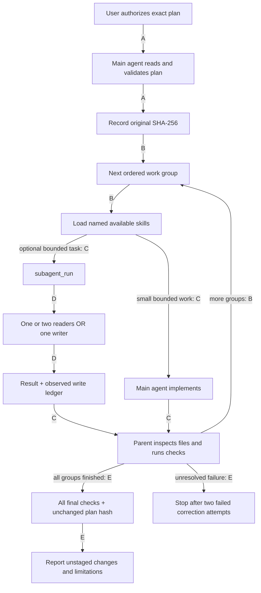
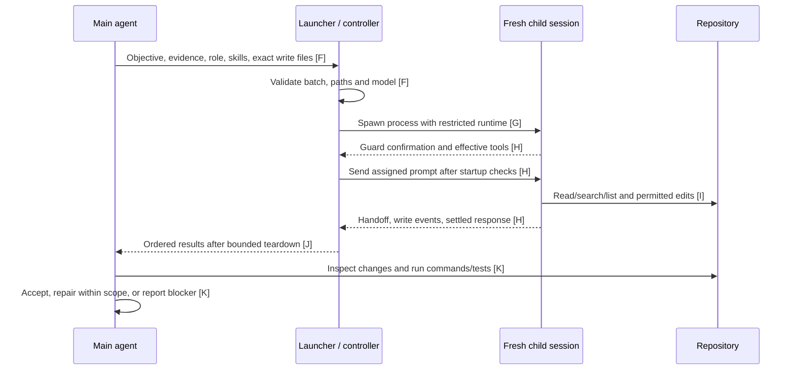

# Who executes, delegates and verifies?

[Component map](index.md) · [Choose a workflow](flows.md)

**The main agent owns execution and acceptance. A child can help; it cannot certify success for its parent.** Every planning route joins this same instructed loop.

## The shared execution loop

Evidence for nodes and edges: **A** [instructions/orchestraitor.md:19–23](../../instructions/orchestraitor.md); **B** [instructions/orchestraitor.md:17–25](../../instructions/orchestraitor.md); **C** [instructions/orchestraitor.md:7–15](../../instructions/orchestraitor.md); **D** [extensions/subagents.ts:27–87](../../extensions/subagents.ts); **E** [instructions/orchestraitor.md:26–34](../../instructions/orchestraitor.md).

Missing material decisions or required skills block progress. A failed/unavailable final check must be reported; the agent must not claim completion. The loop is a behavioral contract, **not a controller that automatically advances plan groups**.

## What actually happens during delegation?

| Evidence | Source |
| --- | --- |
| F | [extensions/subagents.ts:38–81](../../extensions/subagents.ts). |
| G | [extensions/subagent/controller.mjs:158–165](../../extensions/subagent/controller.mjs), [extensions/subagent/runtime.mjs:7–29](../../extensions/subagent/runtime.mjs). |
| H | [extensions/subagent/controller.mjs:187–220](../../extensions/subagent/controller.mjs). |
| I | [extensions/subagent/guard.mjs:13–83](../../extensions/subagent/guard.mjs). |
| J | [extensions/subagent/controller.mjs:223–285](../../extensions/subagent/controller.mjs), [extensions/subagents.ts:83–87](../../extensions/subagents.ts). |
| K | [instructions/orchestraitor.md:15–28](../../instructions/orchestraitor.md). |

## One example, two ways to execute a group

Suppose an approved plan says: reject empty checkout in `src/cart.ts`, with tests in `tests/cart.test.ts`.

| Mode | Walkthrough |
| --- | --- |
| Direct | Parent reads both files, observes a suitable failing test, implements the rejection and reruns checks. |
| Delegated | Parent can ask two readers to inspect code/tests, **or** assign one writer those two exact files. The parent still runs the tests and inspects the actual diff. Readers and writer are separate batches. |

For deterministic behavior tests, observe failure before the fix and success afterward. If that sequence is inappropriate, explain why and use a proportionate check. A final green diff alone does not prove RED/GREEN ([instructions/orchestraitor.md:13–15](../../instructions/orchestraitor.md)).

## Boundaries worth remembering

- No dedicated persistent planner, executor or verifier agents: these are responsibilities of the main session. Children are fresh, bounded workers.
- Children get selected skills and permitted project instructions, **not the entire parent's conversation or full harness resources** ([extensions/subagents.ts:54–80](../../extensions/subagents.ts), [runtime:13–25](../../extensions/subagent/runtime.mjs)).
- Children cannot use Bash, Git, MCP, codemode or nested delegation. Harness resource directories are protected against child writes; the parent handles those changes directly ([subagent policy:1–102](../../extensions/subagent/policy.mjs)).
- One active batch; at most two readers or one exclusive writer. Tasks have a ten-minute limit. Cancellation preserves partial writes; there is no automatic rollback or durable cross-session recovery ([docs/subagents.md](../subagents.md)).
- `status: completed` means the child finished, not that its work passed acceptance. The parent verifies, and must not call that independent or blind review ([instructions/orchestraitor.md:15–17](../../instructions/orchestraitor.md)).
- The original plan remains unchanged, including checkboxes. Commits require an explicit current user instruction; execution defaults to unstaged working-tree changes ([instructions/orchestraitor.md:23–30](../../instructions/orchestraitor.md)).

For tool schemas, lifecycle edge cases and accounting, continue to [Bounded subagents](../subagents.md). That reference is intentionally separate from this quick guide.
