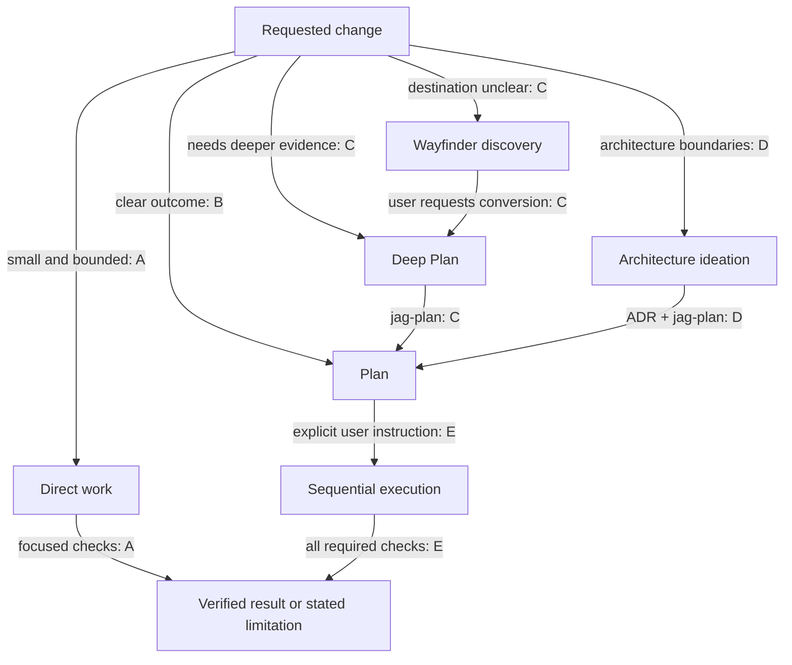
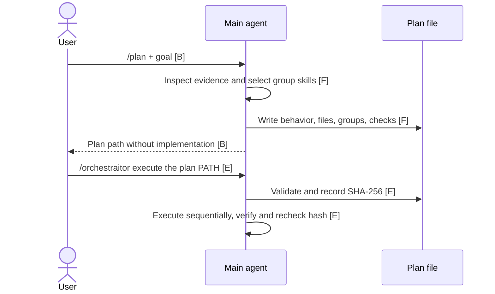

# Choose the workflow

[Component map](index.md) · [Execution details](execution.md)

**There are several preparation routes, but one plan executor.** Calling these “SDD flows” is useful shorthand for specification-led work, not evidence of an implemented SDD state machine.

## Route selector

Node/edge evidence: **A** [instructions/orchestraitor.md](../../instructions/orchestraitor.md); **B** [prompts/plan.md:5–8](../../prompts/plan.md); **C** [jag-evidence:16–37](../../skills/jag-evidence/SKILL.md); **D** [jag-arch-ideas:16–29](../../skills/jag-arch-ideas/SKILL.md); **E** [instructions/orchestraitor.md](../../instructions/orchestraitor.md). These are instructed routes, not automatic dispatch code.

## 1. Direct work: skip the plan when it adds no value

**Who:** the main agent follows Orchestraitor. It inspects, makes a bounded change and runs focused checks. It stops if scope or risk requires planning.

Example in a hypothetical application:
1. Request: `/orchestraitor fix the misspelled empty-state label in src/cart.ts; do not change behavior`.
2. The agent reads that file and relevant checks, changes the label and verifies it.
3. Result: unstaged changes plus verification; no plan or SDD state created.

Contract: [instructions/orchestraitor.md](../../instructions/orchestraitor.md). This is intentionally **not specification-driven planning**.

## 2. Plan: known outcome, explicit contract

**Who plans:** the main agent loads `jag-plan` and `jag-routing`. It inspects evidence and writes only one plan. It selects implementation skill **names**, without loading their bodies yet.

**F:** [jag-plan:16–30](../../skills/jag-plan/SKILL.md), [jag-routing:20–39](../../skills/jag-routing/SKILL.md), [plan template:1–62](../../skills/jag-plan/assets/plan-template.md). B/E are cited above. See [the execution loop](execution.md).

Example:
1. `/plan reject empty cart checkout; inspect src/cart.ts and tests/cart.test.ts; write .ai/deep-planner/plans/reject-empty-cart.md`.
2. Expected plan: WHEN the cart is empty, THEN checkout is rejected; exact files, ordered work and test commands.
3. Review the plan, then request `/orchestraitor execute the plan .ai/deep-planner/plans/reject-empty-cart.md`.
4. The executor loads the selected skills, changes only the authorized scope and reports observed checks.

## 3. Deep Plan: more investigation, same executor

**Who plans:** the same main agent, guided first by `jag-evidence`, then `jag-plan`. It investigates implementations, callers, edge cases and decisions. It does not build or test during this planning route.

Example:
1. `/skill:jag-evidence Deep Plan: make checkout retries safe; inspect existing idempotency and failure handling`.
2. The agent traces current behavior, asks unresolved product decisions and classifies edges as handled, out of scope or open.
3. It writes one `.ai/deep-planner/plans/<slug>.md`, not a roadmap plus phase files.
4. After you inspect the returned path, explicitly request `/orchestraitor execute the plan <returned-path>`.

Difference from `/plan`: the **investigation method**, not a new planner process or execution engine. Contract: [jag-evidence:16–37](../../skills/jag-evidence/SKILL.md).

## 4. Wayfinder: discover the destination before planning

**Who discovers:** the main agent using `jag-evidence`. The output is one discovery document, **not an executable plan**.

Example:
1. `/skill:jag-evidence Wayfinder discovery: checkout is slow; investigate whether caching would help before choosing a change`.
2. The agent reads evidence, records what is known and asks decisions it cannot infer. It writes `.ai/deep-planner/discoveries/<slug>.md`.
3. You resolve the open questions, then ask: `Convert that discovery into a Deep Plan for the agreed scope`.
4. A separate request produces one plan; another explicit request authorizes execution.

Discovery → plan is a **user-directed handoff**, not an automatic phase transition. Contract: [jag-evidence:20–37](../../skills/jag-evidence/SKILL.md).

## 5. Architecture change: decide boundaries, then plan migration

**Who designs:** the main agent using `jag-arch-ideas`. It verifies current architecture, compares 2–3 candidates and records one ADR plus one plan.

Example:
1. `/skill:jag-arch-ideas separate checkout policy from payment infrastructure inside the existing deployable`.
2. The agent compares boundaries and migration trade-offs, then records the decision in an ADR.
3. It writes `.ai/architect/plans/<slug>.md`; group 1 adds architecture guardrails and later groups perform incremental migration.
4. You review the ADR and plan, then request `/orchestraitor execute the plan <returned-path>`.

The ADR explains **why**; the plan specifies **how to change safely**. Both remain documentation until execution is authorized. Contract: [jag-arch-ideas:16–29](../../skills/jag-arch-ideas/SKILL.md).

## Optional UI follows the chosen route

For substantial authorized work, the main agent can project tasks through `orchestraitor_tasks` and collect bounded preferences through `orchestraitor_ask`. [Agents/tasks panels](../interactive-ui.md) show native observations and active-branch receipts. Neither tool selects a workflow, launches a new executor, accepts a child automatically or validates durable resumption. Small/read-only work needs no task artifact; non-TUI work can use textual clarification.

## Optional review is not another executor

After any implementation, `/review <changed-files-or-diff>` asks the main session for evidence-backed findings. It fingerprints the scope and rechecks it before the verdict. Example: `/review src/cart.ts and tests/cart.test.ts`; then separately authorize a specific fix if needed. Review does not silently modify files or become blind dual review ([prompts/review.md:5–14](../../prompts/review.md)).

All examples are navigation examples for a hypothetical checkout application. File names and expected results are illustrative; no application changes or model-run workflows were performed for this guide.
