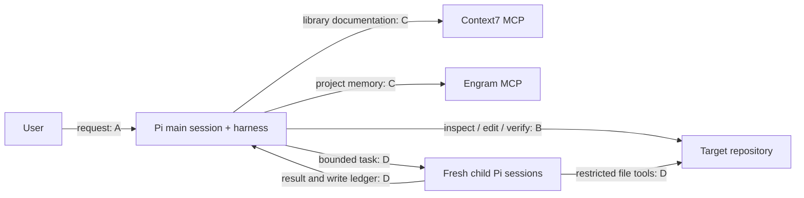
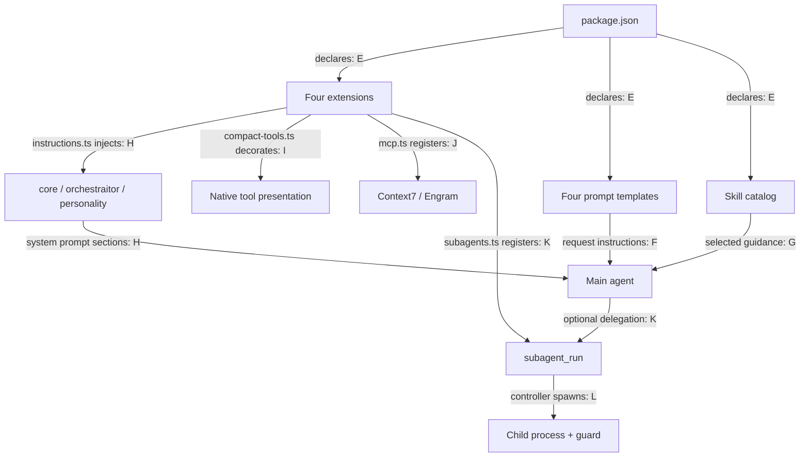

# Understand the harness in five minutes

**One main agent plans and coordinates. Skills guide it; prompts start requests; extensions add executable behavior. There is no durable SDD engine.**

Source: `90b146fa60bc6f40a3f12dd6e5834589eff3bf54` plus the existing working-tree changes inspected for this map. This describes the working tree, not the commit alone. User-authorized exception to architecture-map's usual exclusion of AI harnesses.

## Read only what you need

1. This page: what the pieces do.
2. [Choose a workflow](flows.md): diagrams and a small example for every route.
3. [Execute and delegate](execution.md): who changes files, who checks them, and when work stops.

## System context

Evidence for nodes and edges:
- **A:** [prompts/orchestraitor.md:5–8](../../prompts/orchestraitor.md), [prompts/plan.md:5–12](../../prompts/plan.md).
- **B:** [instructions/orchestraitor.md:5–30](../../instructions/orchestraitor.md).
- **C:** [extensions/mcp.ts:3–19](../../extensions/mcp.ts). Registration is not proof of service availability. Engram is not an SDD state store.
- **D:** [extensions/subagents.ts:27–87](../../extensions/subagents.ts), [extensions/subagent/runtime.mjs:7–29](../../extensions/subagent/runtime.mjs), [extensions/subagent/guard.mjs:13–83](../../extensions/subagent/guard.mjs).

## Inside the package

These are logical components, **not separately deployed services**. Only delegated children get separate processes.

| Evidence | Source |
| --- | --- |
| E | [package.json:24–38](../../package.json): extension, skill and prompt resource declarations. |
| F | [prompts/plan.md:5–8](../../prompts/plan.md), [prompts/orchestraitor.md:5–6](../../prompts/orchestraitor.md), [prompts/review.md:5–8](../../prompts/review.md), [prompts/absorb.md:5–7](../../prompts/absorb.md). |
| G | [README.md:65](../../README.md), [skills/implementation-skill-routing/SKILL.md:20–28](../../skills/implementation-skill-routing/SKILL.md): catalog selection, then body loading. |
| H | [extensions/instructions.ts:4–19](../../extensions/instructions.ts): adds sections without replacing Pi/project context. |
| I | [extensions/compact-tools.ts:30–55](../../extensions/compact-tools.ts): presentation, not a scheduler. |
| J | [extensions/mcp.ts:6–19](../../extensions/mcp.ts). |
| K | [extensions/subagents.ts:27–38](../../extensions/subagents.ts), [instructions/orchestraitor.md:15](../../instructions/orchestraitor.md). |
| L | [extensions/subagent/controller.mjs:158–165](../../extensions/subagent/controller.mjs), [extensions/subagent/child.mjs:18–28](../../extensions/subagent/child.mjs), [extensions/subagent/runtime.mjs:13–25](../../extensions/subagent/runtime.mjs). |

## The distinctions that prevent confusion

| Piece | What it actually is |
| --- | --- |
| Prompt | A reusable request. `/plan` does not start a separate planner agent. |
| Skill | Instructions and supporting resources, not an autonomous worker. See the [catalog](../skills.md). |
| Orchestraitor | The execution contract followed by the **main session**, not another process. |
| Subagent | A fresh worker with role `explore`, `review` or `implement`; launched only through `subagent_run`. |
| Plan | A Markdown contract: behavior, ordered groups, exact files, skills and checks. Not an executable scheduler. |
| `.ai/` | Planning/report artifacts; not a durable phase database. |

Sources: [prompts/plan.md:5–8](../../prompts/plan.md), [instructions/orchestraitor.md:1–30](../../instructions/orchestraitor.md), [extensions/subagents.ts:27–36](../../extensions/subagents.ts), [plan template:1–62](../../skills/execution-plan/assets/plan-template.md), [evidence-first-planning:26–37](../../skills/evidence-first-planning/SKILL.md).

## Supporting pieces, not extra SDD stages

- **Product inputs:** PRD, stories and buildable issues can clarify requirements. They do not automatically launch execution. Even `sdd-ready` is an issue label, not a running engine ([buildable-issue:27–49](../../skills/buildable-issue/SKILL.md)).
- **Specialist skills:** architecture, debugging, refactoring and testing guidance are loaded when relevant; they are not a mandatory chain. Plans select at most three implementation skills per group ([implementation-skill-routing:20–39](../../skills/implementation-skill-routing/SKILL.md)).
- **`/review`:** read-only findings; fixes need separate authorization. **`/absorb`:** compares another harness; does not adopt it ([review:5–8](../../prompts/review.md), [absorb:5–7](../../prompts/absorb.md)).
- **Installation and tests:** `scripts/install-pi.mjs` installs/migrates resources; package scripts expose verification. Neither is an SDD coordinator ([package.json:40–44](../../package.json), [README.md:9–25](../../README.md)).

## What is enforced, and what is instructed?

Planning-only scope, plan hashes, sequential groups and parent verification are **agent instructions**. Child tool/path restrictions have executable guards, but are **not an OS sandbox**. No durable SDD resume, automatic commits, TCR, parallel writers or blind dual review is supplied ([instructions/core.md:25](../../instructions/core.md), [instructions/orchestraitor.md:15–30](../../instructions/orchestraitor.md)).

Evidence method: local manifests, instructions and implementation; Graphify index absent. Context7 and Engram tools were unavailable during authoring; installed Pi docs were consulted instead. No architectural hypotheses are presented as facts. Examples on the next pages are illustrative, not executed tests.
